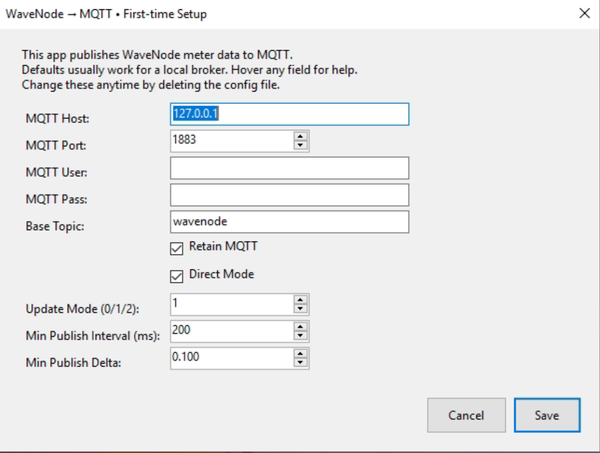

# WaveNode → MQTT Bridge

A small Windows WinForms utility that listens to **WaveNode** power meter messages (via Win32 `RegisterWindowMessage`) and republishes the readings to an **MQTT** broker. It includes a first‑run setup dialog, JSON config with environment‑variable overrides, topic throttling, and derived metrics (reflected watts and return loss). Making your RF station metrics available to automation, dashboards (Grafana, Node-RED, etc.) and remote monitoring.

---

## Features

- Auto-discovers WaveNode’s message window (via registry, process name, or broadcast).
- Publishes **forward power (peak/avg)**, **SWR**, **DC volts/amps**, **aux inputs**, and **rotator info**.
- Computes and publishes:
  - Reflected power (watts) per channel
  - Return loss (dB) per channel
- First-run setup dialog with sensible defaults and tooltips.
- Stores settings in `config.json` for reuse.
- Environment variables override config (useful for testing or containerization).
- Setting to throttle data from WaveNode to protect overloading MQTT queue.

---

## Requirements

- Windows 10/11.
- .NET **6+** for Windows (WinForms).  
  The code uses WinForms APIs (`System.Windows.Forms`) and P/Invoke to `user32.dll`.
- A running **WaveNode** application/device (so it can post messages).
- An **MQTT broker** reachable from this PC (e.g., Mosquitto).

---

## Running the .exe

- Install on the same computer with USB connection to WaveNode hardware.
- Startup WaveNode WN-2 Software.
- Start MQTT Bridge.
- Complete First Run configuration.
- Program will then run as a background task automatically.
- To reset configuration, quit the program and go into the %APPDATA%\WaveNode.Mqtt and delete config.json


---

##  Installation

1. Ensure [.NET 8.0 Runtime](https://dotnet.microsoft.com/en-us/download/dotnet/8.0) is installed.
2. Clone or download this repository.
3. In a new folder type dotnet new winforms -n WaveNode.Mqtt
4. Replace the generated csproj and Program.cs files with the ones in the repo
5. Type dotnet restore
6. Then dotnet build
7. Then Dotnet run
8. To build a self contained .exe:
 dotnet publish -c Release -r win-x64 ^ -p:PublishSingleFile=true -p:SelfContained=true -p:PublishTrimmed=false
9. You will find the .exe in the /bin/Release/net8.0-windows/win-x64/publish folder
10. WaveNode.Mqtt.exe` to a folder of your choice.
11. Run it once – a **setup dialog** appears for MQTT configuration. Tooltips are available to help with configuration settings.


---

## Configuration

Settings are stored at:

```
%APPDATA%\WaveNode.Mqtt\config.json
```

### Example `config.json`:

```json
{
  "MqttHost": "192.168.1.10",
  "MqttPort": 1883,
  "MqttUser": "",
  "MqttPass": "",
  "BaseTopic": "wavenode",
  "Retain": true,
  "DirectMode": true,
  "UpdateMode": 1
  "PublishMinIntervalMs": 200,
  "PublishMinDelta": 0.1
}
```
---

### Defaults & Explanations

| Setting       | Default        | Explanation                                                                 |
|---------------|----------------|-----------------------------------------------------------------------------|
| **MqttHost**  | `127.0.0.1`    | IP/hostname of MQTT broker (e.g., `192.168.1.10`).                         |
| **MqttPort**  | `1883`         | Standard MQTT port (use `8883` for TLS).                                    |
| **MqttUser**  | *(empty)*      | Leave blank for anonymous access.                                           |
| **MqttPass**  | *(empty)*      | Leave blank if no password is required.                                     |
| **BaseTopic** | `wavenode`     | Prefix for MQTT topics (e.g., `wavenode/peak_watts/1`).                     |
| **Retain**    | `true`         | Retain messages on broker so dashboards see the latest value immediately.   |
| **DirectMode**| `true`         | Ask WaveNode to send directly to our app window (not just broadcast).       |
| **UpdateMode**| `1`            | `0` = all samples, `1` = only changes, `2` = only on request.               |
| **PublishMin|  `200`           | Time between topic updates in milliseconds.
IntervalMs**
| ** PublishMin|  `0.1`          | Delta between value changes before update threshold is met. 
Delta**

---

## MQTT Topics

### Forward Power
- `wavenode/peak_watts/<ch>` – Forward peak power in watts
- `wavenode/avg_watts/<ch>` – Forward average power in watts

### SWR
- `wavenode/swr<ch>` – Standing Wave Ratio

### Computed Metrics
- `wavenode/ref_watts/peak/<ch>` – Reflected peak power (watts)
- `wavenode/ref_watts/avg/<ch>` – Reflected average power (watts)
- `wavenode/return_loss/<ch>` – Return loss in dB (`inf` if perfect match)

### Supply & Aux
- `wavenode/dc/volts` – Supply voltage
- `wavenode/dc/amps` – Supply current
- `wavenode/aux/1` and `wavenode/aux/2` – Auxiliary inputs

### Rotator
- `wavenode/rotator/heading/1`
- `wavenode/rotator/heading/2`
- `wavenode/rotator/destination_heading`
- `wavenode/rotator/in_motion/1`
- `wavenode/rotator/in_motion/2`

### Debug
- `wavenode/debug/test_float`
- `wavenode/debug/wavenode_hwnd`
- `wavenode/unknown/<id>` – Any unrecognized message types

---

### Environment variable overrides

These override the JSON at startup (useful for tests/automation):

| Variable | Meaning |
|---|---|
| `MQTT_HOST` | Broker host or IP. |
| `MQTT_PORT` | Broker TCP port (e.g., 1883 / 8883). |
| `MQTT_USER` | Username (if broker requires). |
| `MQTT_PASS` | Password (if broker requires). |
| `MQTT_BASE_TOPIC` | Topic prefix (default `wavenode`). |
| `MQTT_RETAIN` | `true`/`false` (retain messages except fast-changing topics). |
| `WAVENODE_DIRECT` | `true`/`false` (request direct messages to our hidden window). |
| `WAVENODE_UPDATE_MODE` | `0`, `1`, or `2` (all, on-change, or on-request). |
| `WAVENODE_MIN_INTERVAL_MS` | Minimum ms between publishes for *same topic*. |
| `WAVENODE_MIN_DELTA` | Minimum float change required before republishing. |

> Tip: Clear or delete `%APPDATA%\WaveNode.Mqtt\config.json` to re-run setup.

---

## Example Output

```
Assuming defaults (`BaseTopic = "wavenode"`):

wavenode/peak_watts/1            "123.4"
wavenode/avg_watts/1             "110.2"
wavenode/swr1                    "1.35"
wavenode/ref_watts/peak/1        "3.12"
wavenode/return_loss/1           "16.4"
wavenode/dc/volts                "13.72"
wavenode/rotator/heading/1       "220"
wavenode/rotator/in_motion/1     "1"
wavenode/debug/wavenode_hwnd     "1315312"
```

___

## Development Notes

- `Program.cs` contains startup logic + config handling.
- `WaveNodeMqttApp` handles Win32 interop + MQTT publishing.
- Derived metrics use formulas:

  ```
  |Γ| = (SWR - 1) / (SWR + 1)
  Pref = Pfwd * |Γ|²
  RL(dB) = -20 * log10(|Γ|)
  ```

---

## License

MIT – see [LICENSE](LICENSE).

---

## Contributing

Pull requests welcome!  
Ideas: add TLS support, auto-update, system service wrapper, or JSON payload publishing.


## MQTT Topics Reference

All metrics are published under the configured **Base Topic** (default: `wavenode`).

| Topic Suffix                  | Description                                   | Example Payload |
|-------------------------------|-----------------------------------------------|-----------------|
| `peak_watts/1..4`             | Peak forward power, channels 1–4              | `100.5` (watts) |
| `avg_watts/1..4`              | Average forward power, channels 1–4           | `95.3` (watts)  |
| `swr1..4`                     | Standing Wave Ratio (SWR), channels 1–4       | `1.25`          |
| `ref_watts/peak/1..4`         | Computed peak reflected power                 | `2.4` (watts)   |
| `ref_watts/avg/1..4`          | Computed average reflected power              | `1.9` (watts)   |
| `return_loss/1..4`            | Computed return loss (dB)                     | `16.2` (dB)     |
| `dc/volts`                    | DC supply voltage                             | `13.8` (V)      |
| `dc/amps`                     | DC supply current                             | `22.5` (A)      |
| `aux/1`, `aux/2`              | Auxiliary analog inputs                       | `3.3`           |
| `rotator/heading/1`, `/2`     | Current rotator heading(s)                    | `123.0` (deg)   |
| `rotator/destination_heading` | Target heading                                | `270.0` (deg)   |
| `rotator/in_motion/1..2`      | Rotator motion state (0 = stopped, 1 = moving)| `1`             |
| `debug/test_float`            | Debug/test float values from WaveNode         | `0.123`         |
| `debug/wavenode_hwnd`         | Window handle of detected WaveNode app        | `131234`        |
| `unknown/<id>`                | Catch-all for unrecognized message IDs        | (varies)        |

---

## Troubleshooting

- **No MQTT output**  
  - Verify broker address/port in setup or `config.json`.
  - Check broker auth or allow anonymous connections.
  - Look for console logs about **connect** errors.

- **WaveNode HWND not found**  
  - Ensure WaveNode app is running and visible at least once.
  - Confirm the registry key exists (`HKCU\Software\WaveNode\WN\Handle`) or that the process name matches one of the known options.

- **Too many MQTT messages**  
  - Increase `PublishMinIntervalMs` and/or `PublishMinDelta` in settings or via environment variables.

- **Dashboard shows stale values**  
  - Consider disabling `Retain` (globally) or remember that fast topics are already non‑retained.

---

### Notes
- **Reflected power and return loss** are derived values, computed from forward power and SWR.
- All MQTT messages are published with the `retain` flag by default (can be changed in config).
- Topics are prefixed by your configured **Base Topic**. For example, `wavenode/peak_watts/1`.

---

## Architecture Overview


---

## Support This Project

If you find this useful, star ⭐ the repo! It helps others discover it.

---

## More Info

Blog: https://hamradiohacks.blogspot.com

GitHub: https://github.com/n3bkv

---
